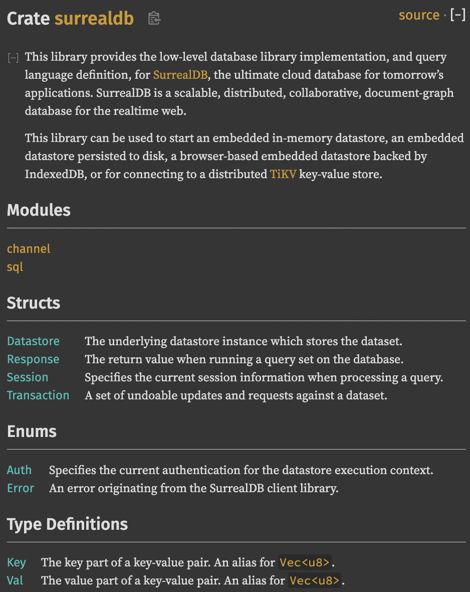
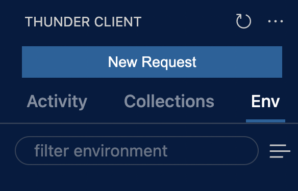

# SurrealDB

most compeling resource to understand the value of SurrealDB :

> [why](https://surrealdb.com/why) Surreal?

> [Surreal? A closer look at NewSQL Relational Data](https://www.youtube.com/watch?v=C7WFwgDRStM) (2:46 min)

> [Crate surrealdb](https://docs.rs/surrealdb/1.0.0-beta.7/surrealdb/) > 


# START TUTORIAL

[100s video](https://www.youtube.com/watch?v=C7WFwgDRStM) about SurrealDB

[tutorial](https://www.youtube.com/watch?v=LCAIkx1p1k0)

# install SurrealDB


[install](https://surrealdb.com/install)

## quick add code to github

to add locally hosted code to github see documentation
👇

[github docs](https://docs.github.com/en/get-started/importing-your-projects-to-github/importing-source-code-to-github/adding-locally-hosted-code-to-github)

<!-- ===================== -->
<!-- install surreal====== -->
<!-- ===================== -->

# installing SurrealDB on macOS

for other OS, see [installation](https://surrealdb.com/docs/start/installation)

```bash
# for macOS
brew install surrealdb/tap/surreal
```

check if installed

```bash
surreal help
```


## quick source control

```bash
git status
&&
git add .
&&
git status
&&
# replace "a commit message"
git commit -m "a commit message"
&&
#push to origin, main branch.
git push -u origin main
```

# runing using Rest API

add Thunderl Client to VSCode


# star the server

run the SurrealDB command with a root user

```bash
surreal start --log debug --user root --pass root memory
```




[HTTP: localhost:8000/sql](http://localhost:8000/sql)
