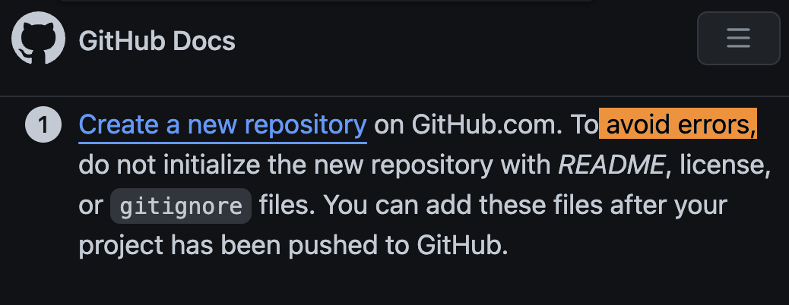

# SurrealDB

Why SurreaDB? and not another?

# Start

<!-- ===================== -->
<!-- quick mkdir           -->
<!-- ===================== -->

## quick mkdir


<!-- ===================== -->
<!-- quick add locally
 hosted code to github     -->
<!-- ===================== -->

## quick add locally hosted code to github

[github docs](https://docs.github.com/en/get-started/importing-your-projects-to-github/importing-source-code-to-github/adding-locally-hosted-code-to-github)

> <sup>👉 👀 note:</sup> 

# instal surrealdb

for macOS

```bash
brew install surrealdb/tap/surrealdb
```

```bash
surreal help

```

## 1. Step

# Terminology

Server side libraries vs client-side library

```

```

```

```
