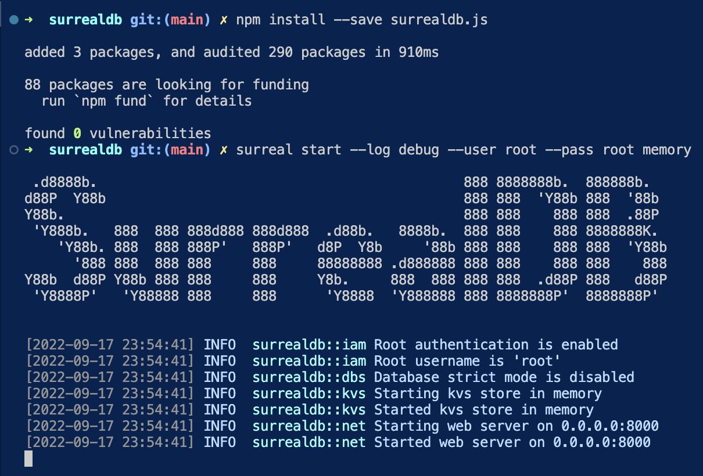

# SurrealDB

[why](https://surrealdb.com/why) SurreaDB? and not another?

[#100SecondsOfCode](https://www.youtube.com/watch?v=C7WFwgDRStM) about SurrealDB by Fireship


# Start

<!-- ===================== -->
<!-- quick mkdir           -->
<!-- ===================== -->

## quick mkdir


<!-- ===================== -->
<!-- quick add locally
 hosted code to github     -->
<!-- ===================== -->

## quick add code to github

to add locally hosted code to github see documentation
👇

[github docs](https://docs.github.com/en/get-started/importing-your-projects-to-github/importing-source-code-to-github/adding-locally-hosted-code-to-github)

<!-- ===================== -->
<!-- install surreal====== -->
<!-- ===================== -->

# installing SurrealDB on macOS

for other OS, see [installation](https://surrealdb.com/docs/start/installation)

```bash
# for macOS
brew install surrealdb/tap/surreal
```

check if installed

```bash
surreal help
```


## quick source control

```bash
git status
&&
git add .
&&
git status
&&
# replace "a commit message"
git commit -m "a commit message"
&&
#push to origin, main branch.
git push -u origin main
```

# star the server

```bash
surreal start --log debug --user root --pass root memory
```


# insert and query data using the SurrealQL REST endpoint

Surreal queries are submitted as `HHTP POST`

`HTTP POST` is the most widely supported method of submitting data to a web server

The SurrealQL REST endpoint by default is

[http://localhost:8080/surrealql
](http://localhost:8080/surrealql)

## connect to SurrealDB

````bash
## insert data

use `cURL` on the command-line.

```bash
DATA="INFO FOR DB;"
curl --request POST \
	--header "Content-Type: application/json" \
	--header "NS: test" \
    # header "NS: test" means use the test namespace
	--header "DB: test" \ # header "DB: test" means use the test database
	--user "root:root" \ #root:root is the default user and password
	--data "${DATA}" \
    # data is the data to insert
	http://localhost:8000/sql
````


# inserting data shcemaless mode

> ["By default, SurrealDB doesn't need to have tables or fields defined before inserting data. Instead the database can be queried in schemaless mode, and tables are created ad hoc."](https://surrealdb.com/docs/start#inserting-data)

> SurrealDB allows you to traverse related records efficiently without needing to use JOINs.

# START TUTORIAL

[100s video](https://www.youtube.com/watch?v=C7WFwgDRStM) about SurrealDB

[tutorial](https://www.youtube.com/watch?v=LCAIkx1p1k0)

# install SurrealDB


[install](https://surrealdb.com/install)

# runing using Rest API

add Thunderl Client to VSCode


# run the SurrealDB command with a root user

    ```bash
    surreal start --log debug --user root --pass root memory


